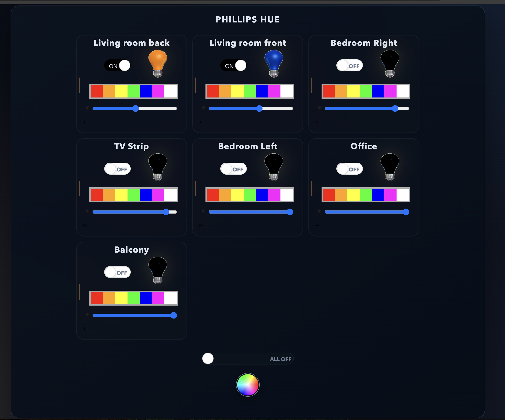

# HueTube

HueTube is a live-updating dashboard for controlling Philips Hue lights from a browser.

It supports:
- Individual light power and color controls
- Group-level "ALL LIGHTS" control
- Basic-auth protected write endpoints
- Optional Wemo integration (gracefully disabled when unavailable)

## Dashboard Preview



## Requirements

- Node.js 18+ (validated on modern Node)
- npm
- Philips Hue bridge on your local network
- Hue API username/token

Optional:
- MongoDB (if unavailable, app falls back to in-memory auth table)

## Configuration

You can configure runtime settings with environment variables (recommended):

- `HUE_BRIDGE_HOST` (example: `192.168.0.253`)
- `HUE_API_URI` (example: `/api/<hue-username>`)
- `HUE_PORT` (default: `80`)
- `PORT` or `NODE_PORT` (default app port: `7076`)
- `MONGO_HOST` (default: `mongodb`)
- `MONGO_DB` (default: `authentication`)
- `ADMIN_USERNAME` (default: `admin`)
- `ADMIN_PASSWORD` (overrides `salt.txt`)

You can also edit `Config.js` directly, but env vars are preferred for local/dev/prod parity.

## Authentication

Write operations use HTTP Basic auth.

Default username:
- `admin`

Default password source:
- plaintext content of `salt.txt`

Recommended:
- set `ADMIN_PASSWORD` in your shell/environment instead of editing files.

## Run Locally

```bash
npm install
npm start
```

App URL:
- `http://localhost:7076` (or your configured `PORT`)

Example startup with env vars:

```bash
HUE_BRIDGE_HOST=192.168.0.253 \
HUE_API_URI=/api/<your-hue-username> \
HUE_PORT=80 \
npm start
```

## Notes on Frontend Assets

This project serves compiled frontend assets by default:
- `public/stylesheets/dist/styles.min.css`
- `public/javascripts/dist/scripts.min.js`

A refresh layer is loaded from:
- `public/stylesheets/revive.css`

## Optional Wemo Behavior

Wemo support is optional. If the legacy `wemo` dependency cannot load on your Node version, Hue functionality still runs.

## Troubleshooting

- If `npm install` fails due to permission/symlink issues:

```bash
rm -rf node_modules package-lock.json
npm cache clean --force
npm install
```

If needed:

```bash
sudo chown -R "$(whoami)" ~/.npm /Users/joshuakopman/HueTube
```

- If MongoDB is unavailable, startup should log a fallback message and continue using in-memory auth.
